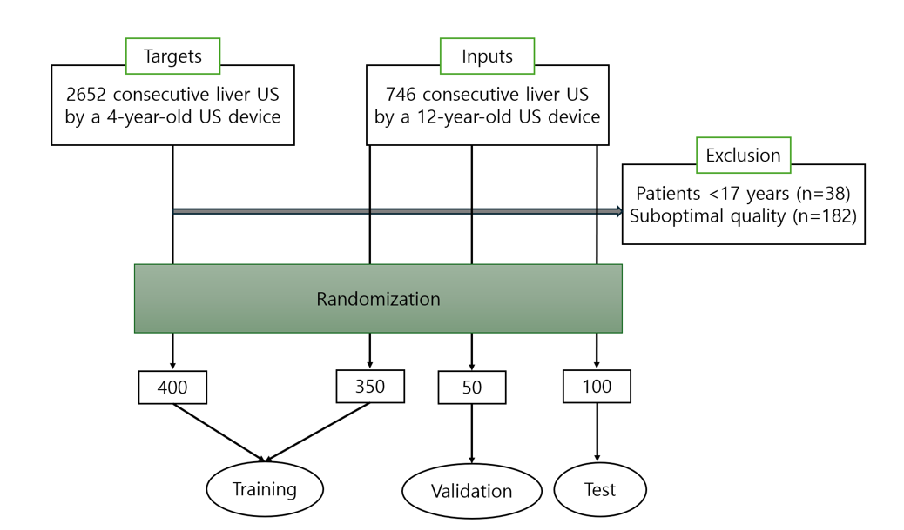
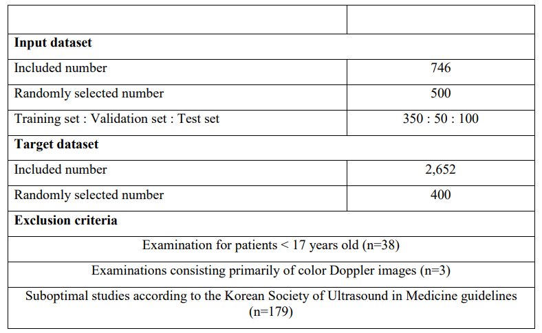
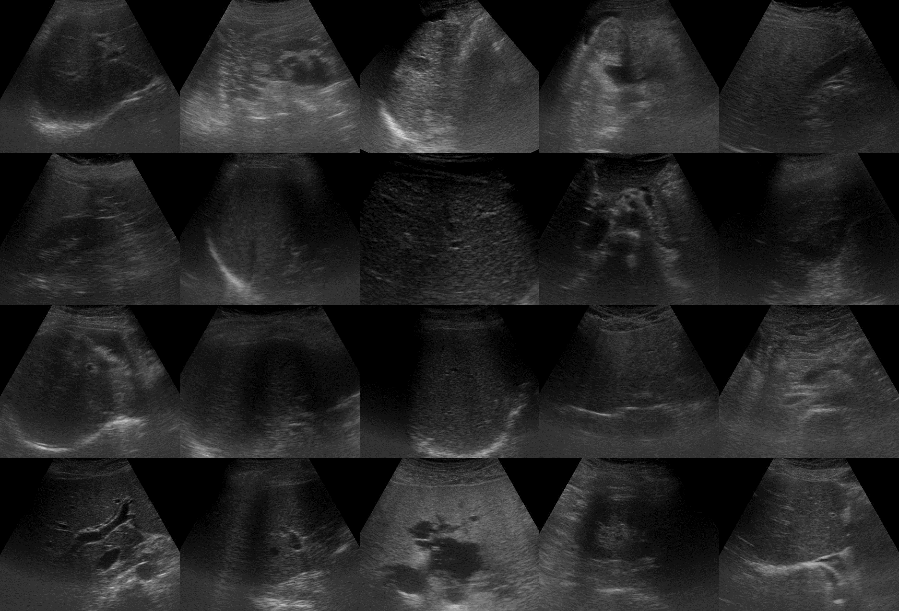
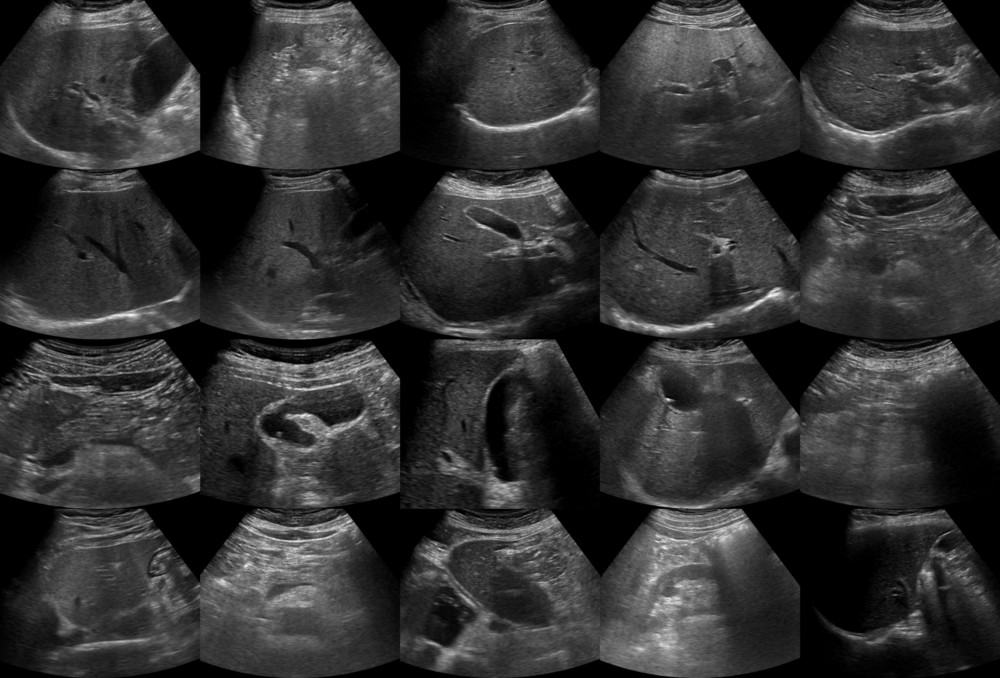

# Image-quality-improvement-of-liver-ultrasound-using-unsupervised-deep-learning

# 📊Datasets📊

# Description
From January to April 2022, we prepared two categories of datasets for training our deep learning-based image quality improvement algorithm, i.e., 1) liver US obtained by a US machine >10 years old, consequently having quality deterioration, served as an input, and 2) liver US obtained by a high-end US machine manufactured within last five years, served as a target (Fig. 1). Basically, all liver ultrasound scans included a minimum of 10 images (ranging from 10 to 38). These images encompassed suitable liver and gallbladder visuals, with no cine clips present. Additionally, all images were acquired using a 1-6 MHz convex transducer. For an input dataset, we randomly selected 500 liver US (training sets: validation sets: test sets = 350: 50:100) from 746 consecutively enrolled examinations from January 2016 to February 2018, performed by a hepatologist with 20 years of experience, using a 12-year-old US system (SSD-alpha 10 Ultrasound System, Aloka Co., Ltd., Japan). For a target dataset, we randomly selected 400 out of 2,652 liver US performed by one of three board-certified abdominal radiologists with more than 15 years of experience (E.S.L., H.J.P., and B.I.C.) from December 2020 to December 2021. All US of target datasets were obtained by a high-end US machine (Aplio i900, Canon Medical Systems, Japan), manufactured within the last 5 years from the date of examination.

# Sample images
* Input dataset (low-quality)

* Target dataset (high-quality)

* Link
  https://drive.google.com/drive/folders/1iRjuik8wzecgdYMLSGNozMdrU_73S2oH?usp=drive_link
